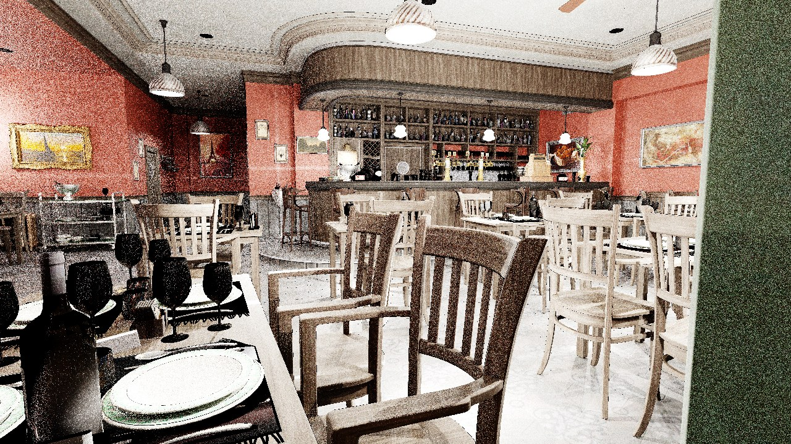
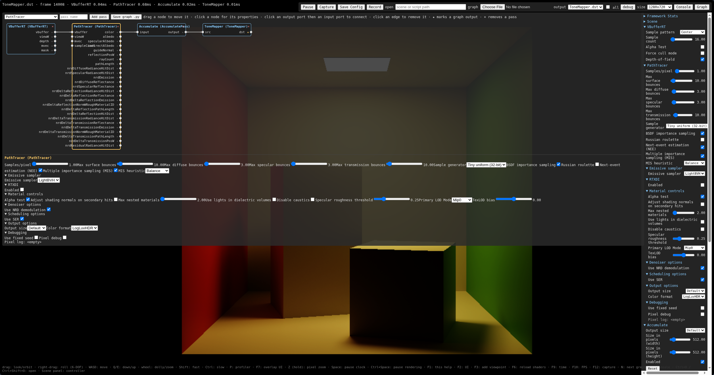

# web-falcor

[](https://github.com/windingwind/web-falcor/actions/workflows/ci.yml)

WebGPU-based reimplementation of [NVIDIA Falcor](https://github.com/NVIDIAGameWorks/Falcor)
targeting 1:1 feature parity where the web platform allows. **See the [design docs](docs/)**
for the framework design, the Falcor→web module mapping, and the feature parity matrix
(including features that are impossible in the browser and why).

**Try it in the browser: [windingwind.github.io/web-falcor](https://windingwind.github.io/web-falcor/)**, or run the viewer
locally with `npx @web-falcor/mogwai`.

> **Browser requirements:** WebGPU with at least 16 storage buffers per shader stage
> (`maxStorageBuffersPerShaderStage`, see [webgpureport.org](https://webgpureport.org)). Safari, and Chrome or Edge on
> Windows and Linux, usually meet it. Chrome and Edge on macOS currently allow 10, too few for the path tracer and
> the G-buffer passes; they stop with an error naming the pass and the limit. Use Safari on a Mac.



*Amazon Lumberyard Bistro (interior), path-traced with web-falcor on WebGPU — full material system,
emissive lighting, and software ray tracing, cross-validated against native Falcor's DXR output
(see the [parity matrix](docs/parity-matrix.md) and [oracle results](docs/testing.md)).*

## Quick start (npm, recommended)

Everything here runs from npm, in **any directory of your own**: you don't need to clone this repository, Falcor,
or build anything. Node 18+ and a WebGPU browser are enough.

**Run the viewer** (Falcor's Mogwai, prebuilt):

```sh
npx @web-falcor/mogwai                        # http://localhost:5173/, with the Cornell box
npx @web-falcor/mogwai --media ./my-scenes    # serve your own scenes at /Falcor/media/
```



*The Mogwai viewer on the default Cornell box — the render-graph editor (top left), the selected
pass's properties, and Mogwai's settings panel (right), all editable live.*

**Write a render pass** as a plugin. Start from an empty directory, outside this repository:

```sh
mkdir my-work && cd my-work
npx @web-falcor/mogwai new MyPass   # creates ./my-pass/, a new project for the pass
cd my-pass
npm install
npm run dev                         # prints a URL: the viewer with your pass loaded
```

The new project contains:

| File | What it is |
| --- | --- |
| `MyPass.ts` | the render pass (a compute pass that scales its input); edit its inputs, outputs and `execute()` |
| `MyPass.cs.slang` | its Slang shader |
| `MyPass.py` | a render graph that runs the path tracer and feeds its image through `MyPass`; `npm run dev` opens it |

Edit the pass or the shader and reload the page to see the change. To use the pass elsewhere:

- **in the viewer's graph editor:** open **Graph** and pick `MyPass` from the pass list;
- **in your own graph script:** `createPass("MyPass", {'scale': 0.5})`, like any Falcor pass;
- **anywhere else:** `npm run build` writes `dist/MyPass.js`. Any web-falcor viewer loads it with
  `?plugin=<its URL>`, including the online demo and `npx @web-falcor/mogwai --plugins <dir>`.

If your work needs no change to web-falcor itself, **release it this way, from your own repo**, rather than
forking web-falcor. Host the built `.js` anywhere that allows CORS and anyone can run it in the
[online demo](https://windingwind.github.io/web-falcor/) with `?plugin=<its URL>`.

**Build your own app** on the library:

```sh
npm install @web-falcor/falcor @web-falcor/render-passes @web-falcor/mogwai
```

[docs/npm.md](docs/npm.md) has a minimal app, the Vite plugin that supplies the runtime assets (shaders, the Slang
compiler, Pyodide), and the details of `web-falcor dev`.

## Working from source

Use a checkout to change web-falcor itself (core features, fixes, ports of upstream Falcor passes), or to run
the test suites. The runtime compiles Slang→WGSL in the browser, so it needs the upstream Falcor shader
**sources** and the slang-wasm compiler. `setup:web` fetches both from GitHub at pinned versions, with **no
Falcor clone and no native build**:

```sh
npm install
npm run setup:web   # fetch Falcor shader sources, SDK headers + slang-wasm (~30 MB, no clone)
npm run typecheck
npm run dev         # Mogwai dev server (needs a WebGPU browser)
```

`setup:web` also fetches the SDK shader headers the upstream shaders include:
NanoVDB's `PNanoVDB.h` (pulled in by `Scene.slang`, so **every** scene-bound
pass needs it) and the RTXDI SDK headers. They come from the public OpenVDB and
RTXDI GitHub repos at the versions Falcor pins (byte-identical to its packman
packages); the RTXDI headers are under NVIDIA's RTX SDKs license (see
[THIRD-PARTY-NOTICES.md](THIRD-PARTY-NOTICES.md)). Media/test scenes are not
fetched — see below.

### Adding a pass in the checkout

```sh
npm run new:pass -- MyPass            # an in-tree pass under packages/render-passes/src/
npm run new:pass -- MyPass --plugin   # a plugin in plugins/MyPass/, loaded by the dev server
```

In-tree passes are for ports of upstream Falcor passes and passes every user should get; everything else is
better as a plugin (see above). [docs/extending.md](docs/extending.md) explains which route to take, and covers
core changes and shader overrides.

### Example scenes

To try the app on real content, fetch Falcor's example scenes (also no clone —
they come from the same media bundle Falcor's `setup.sh` pulls):

```sh
npm run download:scenes                 # all bundled scenes (~120 MB)
npm run download:scenes -- --list       # list what's available
npm run download:scenes -- Arcade       # just one scene (Arcade, test_scenes, …)
npm run download:scenes -- Bistro       # a large ORCA scene by name
npm run download:scenes -- cornell-box  # a Bitterli pbrt-v4 scene
npm run download:scenes -- --all        # everything, incl. the big ORCA scenes
```

Scenes land under `Falcor/media/<Scene>/`, which the dev server serves at
`/Falcor/media/…`. The Mogwai viewer loads `test_scenes/cornell_box.pyscene` by
default.

Single-file assets that no scene bundle ships — compressed OpenVDB volumes,
measured BRDF data — come from a second catalog:

```sh
npm run download:assets                 # the default set (~14 MB)
npm run download:assets -- --list       # list the catalog
npm run download:assets -- openvdb      # just one group
npm run download:assets -- --all        # everything, incl. the large volumes
```

Some formats have no reproducibly downloadable content at all: the MERL BRDF
database sits behind a licence agreement, published IES photometry carries no
reusable licence, and nothing ships `.sdfg`/`.sdf` grids. For those, a generator
writes files that are exact to the published format and whose content is
analytic, which is what the tests check against:

```sh
node scripts/gen-assets.mjs                # everything (~135 MB)
node scripts/gen-assets.mjs --list         # list what would be written
node scripts/gen-assets.mjs merl ies       # only the named groups
```

Mitsuba 3 has the same problem — its scene repository declares no licence — so
the fixtures under `tests/gpu/assets/mitsuba/` are scenes written to the format's
spec whose rendered answer is closed-form.

Three kinds of scene are covered by the one command:

- **Bundled scenes** (`Arcade`, `test_scenes`, `inv_rendering_scenes`,
  `test_images`) come from Falcor's official media bundle — one ~120 MB archive,
  so naming scenes only limits what is written to disk, not the download.
- **ORCA showcase scenes** (`Bistro`, `EmeraldSquare`, `SunTemple`, `ZeroDay`)
  are large individual downloads (~0.3–1 GB each) fetched from
  [NVIDIA ORCA](https://developer.nvidia.com/orca). They are opt-in: named
  explicitly or via `--all`; the plain default only pulls the bundled scenes.
- **Bitterli pbrt-v4 scenes** (`cornell-box`, `veach-mis`, `kitchen`,
  `staircase`, … and any other name from the
  [Rendering Resources](https://benedikt-bitterli.me/resources) page) are loaded
  through web-falcor's pbrt-v4 importer (a port of Falcor's `PBRTImporter`
  subset). `cornell-box` and `veach-mis` are GPU-verified end to end; other
  scenes load best-effort (unsupported materials/textures fall back with a
  warning).

Extracting needs a `unzip` and/or 7-Zip CLI (`p7zip-full` / `7-zip`); the script
prints install hints if one is missing.

To load a pbrt scene in the viewer, point it at the `.pbrt` file, e.g.
`Falcor/media/cornell-box/scene-v4.pbrt`. Mitsuba 3 scenes load the same way
from their `.xml` file; the viewer dispatches on the extension.

## Full setup (develop + run the GPU/oracle tests)

The GPU image tests diff against **native Falcor** captures, which need the
upstream clone built and its media tree. In addition to the setup above:

```sh
# Upstream Falcor clone + media + packman SDK deps, then the native oracle build
git clone https://github.com/NVIDIAGameWorks/Falcor.git && (cd Falcor && ./setup.sh)
cmake --preset linux-gcc -S Falcor && cmake --build Falcor/build/linux-gcc -j16

# Native Slang toolchain (build-time Slang→WGSL for the shader compiler)
mkdir -p tools/slang && curl -L https://github.com/shader-slang/slang/releases/download/v2026.18.2/slang-2026.18.2-linux-x86_64.tar.gz | tar xz -C tools/slang
```

## Tests

```sh
npm test            # unit suite (Node); CI runs this. Media-dependent tests
                    # skip automatically when the Falcor media tree is absent.
npm run test:gpu    # GPU image tests vs native oracles — needs hardware WebGPU
                    # (Vulkan under xvfb) and the full setup above. Local only.
```

CI ([`.github/workflows/ci.yml`](.github/workflows/ci.yml)) runs the from-source
setup path plus `typecheck` + `npm test` on every push and PR — so the badge
above also verifies that the no-clone setup keeps working.

## Layout

- `packages/falcor/` — core library, mirrors `Falcor/Source/Falcor`
- `packages/render-passes/` — render pass plugins, mirrors `Falcor/Source/RenderPasses`
- `packages/mogwai/` — browser application, mirrors `Falcor/Source/Mogwai`
- `packages/slang-compiler/` — build-time Slang→WGSL+reflection driver
- `Falcor/` — upstream shader sources (+ native oracle for tests); fetched, not committed
- `tools/` — Slang toolchains; fetched, not committed

## License

web-falcor's own code is licensed under the [MIT license](LICENSE).

It is a reimplementation derived from [NVIDIA Falcor](https://github.com/NVIDIAGameWorks/Falcor)
(BSD-3-Clause). That upstream license and copyright notice are retained in
[THIRD-PARTY-NOTICES.md](THIRD-PARTY-NOTICES.md), and each shader derived from an
upstream Falcor source is marked in its `WebFalcor/Overrides` header.
